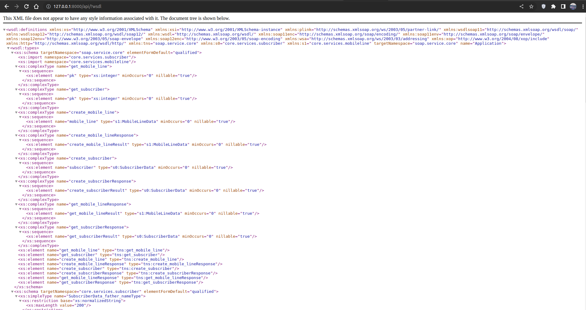
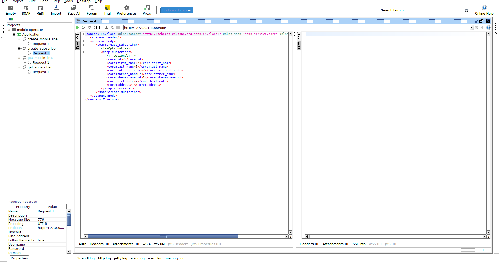

# mobile operator


This is a web service for registering and maintaining mobile phone service customers. It allows users to store and manage customer and service information.

## Table of Content:
- [Business rules](#business-rules)
- [Technology stack](#technology-stack)
- [Installation](#installation)
- [Tests](#tests)
- [Usage](#usage)

## Business rules:
- The subscriber must be over 18 years of age. Minors cannot be registered in the system.
- The subscriber cannot have more than 10 lines. It is not possible to add the 11th service for the subscriber.

## Technology stack:
This web service is implemented using the Django framework and the [Spyne](http://spyne.io/#inprot=Soap11&outprot=Soap11&s=rpc&tpt=DjangoApplication&validator=true) library in the SOAP protocol.

Spyne is a Python RPC toolkit that makes it easy to expose online services that have a well-defined API using multiple protocols and transports. 

## Installation:
To install and run this web service, follow the steps below:
1. Clone the repository:
```shell
git clone https://github.com/MohammadMahdi-Akhondi/mobile_operator.git
```

2. Create and activate a virtual environment:
```shell
python -m venv env
source env/bin/activate    # for Linux/Mac
env\Scripts\activate      # for Windows
```

3. Install required packages:
```shell
cd mobile_operator
pip install -r requirements.txt
```

4. Run database migrations:
```shell
python manage.py migrate
```

5. Start the server:
```shell
python manage.py runserver
```

## Tests:
Tests are included to ensure the functionality of the web service. To run tests, execute the following command:
```shell
python manage.py test
```


## Usage:
To access the documentation for the service, you can follow the link below. 

> http://127.0.0.1:8000/api/?wsdl



You can also use [SoapUI](https://www.soapui.org/downloads/latest-release/) to automatically generate requests.


